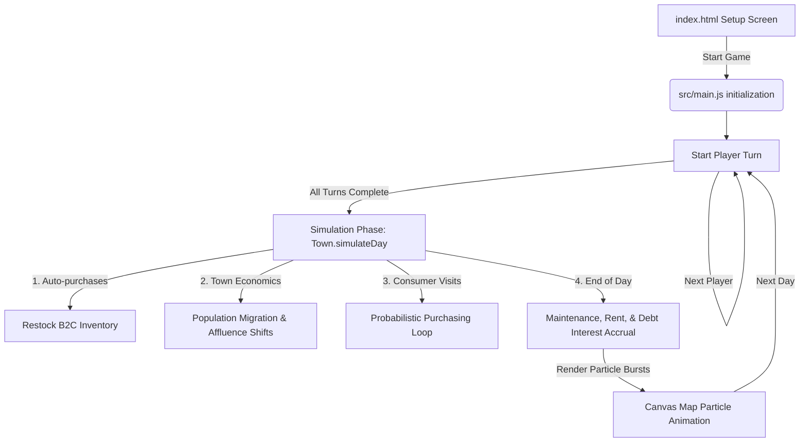

# Agent Onboarding Guide: Entrepreneur Game

Welcome to the **Entrepreneur** project! This document is designed to help agentic coders quickly understand the codebase, architecture, core game mechanics, and design/development patterns.

---

## 🎮 Project Overview

**Entrepreneur** is a local multiplayer top-down business simulation game. 
- **Goal:** Players compete to achieve the highest **Net Worth** (Cash + Asset Value - Debt) within a set number of days (typically 15, 30, or 45).
- **Core Loop:** 
  1. Players take turns buying properties, upgrading buildings, upgrading personal skills, adjusting prices, and managing their supply chain (restocking raw inventory).
  2. Once all players end their turns, a **Simulation Phase** runs. The town's population visits businesses probabilistically based on needs, pricing, ad awareness, and customer satisfaction.
  3. Rent, bank interest, business maintenance, and passive incomes are processed, and the day advances.

---

## 📂 Codebase Directory Structure

```text
entrepreneur_game/
├── index.html          # Core HTML UI layout, modals, overlays, and hud structure
├── vite.config.js      # Vite build configuration
├── package.json        # NPM scripts & Vite dev dependencies
├── src/
│   ├── main.js         # Core application bootstrap, DOM bindings, and event handlers
│   ├── style.css       # Premium CSS design system (glassmorphism, animations, colors)
│   └── game/
│       ├── Map.js      # HTML5 Canvas rendering of grid, roads, properties & particles
│       ├── Player.js   # Player state, debt, ledger, and skill upgrade modifiers
│       ├── Property.js # Real estate classes (B2C, Farms, Apartments, Banks, AdServices)
│       └── Town.js     # Simulation engine, migration, affluence & consumer choice probability
```

---

## 🏛️ Technical Architecture

The game uses a **Vanilla ES Modules** architecture built around HTML5 Canvas for the visual map and standard HTML/CSS for the HUD controls.

### Class Hierarchy (`src/game/Property.js`)

All real estate inherits from `Property`:
- **`Property`**: Base class containing `id`, `name`, `type`, coordinates, ownership, upgrade level, and base maintenance.
  - **`B2CProperty`**: Direct consumer businesses (`GroceryStore`, `Restaurant`, `RetailStore`, `MechanicShop`). Handles inventory, price setting, and serving customers.
  - **`Farm`**: Produces wholesale raw goods. Sells to B2C properties or clearinghouses.
  - **`Apartments`**: Passive residential buildings generating rent based on occupancy rate.
  - **`Bank`**: Issues loans, collects interest, and receives passive transaction processing fees.
  - **`AdServices`**: Sells advertising packages to boost business `adAwareness`.

### System Interactions & Game Loop



---

## 📊 Core Game Mechanics & Math

### 1. Consumer Purchasing Probability (`Town.js` -> `calculateBusinessScore`)
For each visit, the town determines consumer needs using need weights:
- **`GroceryStore`**: 40% | **`Restaurant`**: 25% | **`RetailStore`**: 20% | **`MechanicShop`**: 15%

Once a need is chosen, businesses compete for the customer based on an attraction score:
$$\text{Score} = \text{Ad Multiplier} \times \text{Satisfaction Multiplier} \times \text{Price Score}$$

- **Ad Multiplier:** $1.0 + (\text{adAwareness} \times 2.0)$
- **Satisfaction Multiplier:** $\text{customerSatisfaction}$ (0.3 to 1.0)
- **Price Score:** Determined by town **Affluence**:
  - **Low Affluence:** Highly price-sensitive. Prices above target face a $1.5\times$ penalty; prices below receive a $0.5\times$ bonus.
  - **Medium Affluence:** Normal price sensitivity. Prices above target face a $0.8\times$ penalty; prices below receive a $0.2\times$ bonus.
  - **High Affluence:** Wealthy residents tolerate prices up to 50% above target. Score is also multiplied by $(1.0 + (\text{upgradeLevel} - 1) \times 0.15)$ for premium storefronts.

### 2. Supply Chain & Restocking
- **Farms** produce raw goods daily.
- **Grocery Stores** and **Restaurants** require raw goods to serve customers.
- **Owned transfers are cash-free** between a player's farm and their retail properties. Non-owned transfers cost the Farm's `wholesalePrice`.
- If a business runs out of stock, it pays **Emergency Market Import Costs** ($18 for Groceries, $28 for Restaurants) per customer, severely denting margins.
- **Auto-Purchase:** Players can set B2C properties to auto-buy stock from specific farms or the emergency market at the start of each simulation phase.

### 3. Bank and Ad Services Monopolies
- **The Bank (`Bank`)** collects a passive transaction fee of $4\%$ on all B2C sales in town. If owned by a player, this fee goes directly to their cash balance. Furthermore, all loan interest paid by other players goes to the Bank owner.
- **Ad Services (`AdServices`)** collects base marketing retainer contracts from the town. When other players buy ad campaigns, 90% of the price is paid to the Ad Services owner.

### 4. Player Skills & Modifiers (`Player.js`)
Players can upgrade skills (exponential cost: $2000 \times 1.5^{\text{level} - 1}$):
- **Technology:** Reduces equipment upgrade costs by $5\%$ per level (max $50\%$).
- **Social:** Reduces interest rates and boosts customer satisfaction by $3\%$ per level.
- **Planning:** Lowers property purchase prices and maintenance costs by $4\%$ per level (max $40\%$).
- **Marketing:** Increases ad package effectiveness by $15\%$ per level.
- **Management:** Lowers operational and employee overhead by $5\%$ per level (max $50\%$).

---

## 🛠️ Developer Rules & Best Practices

To maintain project quality and runtime stability, you **must** adhere to the following rules:

### 🌐 System Environment Rules
1. **OS:** Windows 10/11 using PowerShell. **Do not use `&&`** to chain commands; run them as separate lines or use semi-colons (`;`).
2. **Python Environment:** If executing any Python scripts in this workspace, you **must** use the local virtual environment `.venv`:
   - Run python using: `.venv\Scripts\python.exe`
3. **NPM Commands:** Use `npm run dev` to start the local Vite development server. Use `npm run build` to verify production bundle integrity.

### 🎨 Design & Aesthetic Guidelines
1. **Premium Aesthetic:** The user experience should feel high-end, utilizing dark modes, HSL-tailored colors, and glassmorphism.
2. **Typography:** Use modern, styled typography (e.g., `Outfit` or `Inter` imported from Google Fonts) rather than browser defaults.
3. **Micro-Animations:** Leverage CSS hover transitions, keyframe animations (`animate-fade-in`), and canvas-rendered particles.
4. **No Placeholders:** If assets or graphics are needed, generate/embed working alternatives. Never use blank squares or `TODO` text in place of visuals.

### 📁 Coding Standards
- **Vanilla Javascript:** Avoid adding external frameworks (like React/Vue/Tailwind) unless explicitly requested.
- **Documentation:** Retain all existing JSDoc comments. Keep files organized and clean.
- **Semantic HTML:** Use proper tags (`<header>`, `<section>`, `<aside>`) and ensure all interactive elements have unique, descriptive `id` attributes.
- **References:** When referencing files in discussions or documentation, write clickable links (e.g., [Player.js](file:///C:/Users/shane/Documents/entrepreneur_game/src/game/Player.js)).

---

## 🚀 Speeding Up Development: Quick Commands

- **Start Dev Server:** `npm run dev`
- **Build Project:** `npm run build`
- **Preview Production Build:** `npm run preview`
